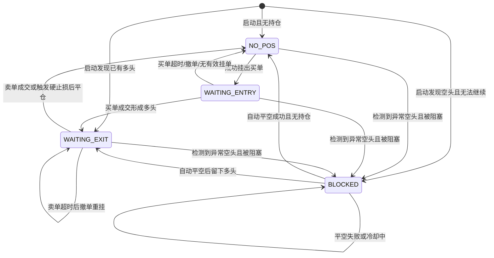
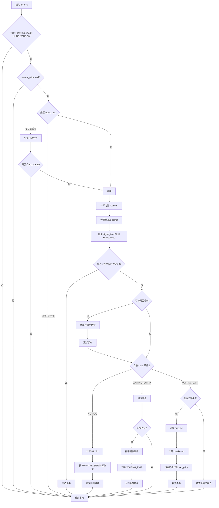

# strategy_mean.py 交易策略说明

本文档详细说明 `core/strategy_mean.py` 中均值回归策略的交易思想、运行流程、状态机、下单规则、风控逻辑与关键参数。

---

## 1. 策略定位

该策略是一个**基于 1 分钟 K 线的短周期均值回归策略**，主要特点如下：

- 交易标的：由 `core/config_mean.py` 中的 `SYMBOL` 指定。
- 市场类型：Binance U 本位合约。
- 方向限制：**只做多**。
- 核心思想：
  - 当价格偏离最近一段时间的均值过多时，认为价格存在向均值回归的概率。
  - 因此在均值下方分层挂买单。
  - 成交后，在均值上方附近挂卖单获利了结。
- 风控方式：
  - 挂单超时撤单
  - 保本卖出约束
  - 硬止损
  - 发现反向空单时自动平空或阻塞策略

这个策略适合**震荡市、短线来回波动行情**，不适合强趋势单边下跌行情。

---

## 2. 核心数据来源

策略通过两类接口工作：

### 2.1 REST 接口
用于：

- 获取历史 K 线，初始化价格窗口
- 获取交易所精度与最小下单限制
- 查询账户持仓
- 下单、撤单

### 2.2 WebSocket 行情流
订阅：

- `1m kline` 实时 K 线

用途：

- 持续获取最新价格
- 在 1 分钟 K 线收盘时更新滚动窗口
- 每次收到行情时触发策略判断

---

## 3. 使用的价格序列与统计量

策略维护一个固定长度的收盘价队列：

- 长度：`KLINE_WINDOW`
- 当前配置：`10`

即策略始终基于**最近 10 根 1 分钟收盘价**做计算。

### 3.1 均值

记最近 $N$ 根收盘价为：

$$
P_1, P_2, \dots, P_N
$$

则均值为：

$$
P_{mean} = \frac{1}{N}\sum_{i=1}^{N} P_i
$$

其中：

- $N = \text{KLINE\_WINDOW}$

### 3.2 波动率

策略使用收盘价标准差表示短期波动率：

$$
\sigma = \sqrt{\frac{1}{N}\sum_{i=1}^{N}(P_i - P_{mean})^2}
$$

### 3.3 波动率下限

为了避免极端横盘时 $\sigma$ 太小，导致买单和卖单贴近现价，策略设置了波动率下限：

$$
\sigma_{min} = 当前价格 \times \text{SIGMA\_FLOOR\_PCT}
$$

实际使用的波动率为：

$$
\sigma_{used} = \max(\sigma, \sigma_{min})
$$

当前配置：

- `SIGMA_FLOOR_PCT = 0.001`
- 即波动率至少按当前价格的 **0.1%** 计算

---

## 4. 状态机设计

策略通过 `self.state` 管理当前运行状态。

### 4.1 `NO_POS`
无持仓、无有效卖单，等待寻找新的开仓机会。

### 4.2 `WAITING_ENTRY`
已经挂出买入限价单，等待成交。

### 4.3 `WAITING_EXIT`
已经持有多单，等待卖出离场。

### 4.4 `BLOCKED`
策略被阻塞，通常是因为检测到反向空头持仓且暂时无法处理。

状态机的核心目的：

- 防止重复下单
- 明确区分“等开仓”和“等平仓”阶段
- 在异常持仓情况下避免策略继续错误运行

---

## 5. 启动时的初始化逻辑

机器人启动后主要做三件事：

### 5.1 获取初始历史 K 线
通过 REST 拉取最近 `KLINE_WINDOW` 根 1 分钟 K 线，取其收盘价填充队列。

作用：

- 避免刚启动时因数据不足无法计算均值和波动率

### 5.2 获取交易所规则
读取当前交易对的：

- 价格精度 `pricePrecision`
- 数量精度 `quantityPrecision`
- 最小价格跳动 `tickSize`
- 最小下单数量 `minQty`
- 数量步长 `stepSize`
- 最小名义金额 `minNotional`

作用：

- 确保下单价格和数量符合交易所要求
- 避免因为精度错误、最小下单金额不足而报错

### 5.3 同步账户状态
启动时会：

- 取消该交易对所有未完成订单
- 查询当前持仓
- 恢复状态机

处理方式：

- 如果已有多头持仓：进入 `WAITING_EXIT`
- 如果已有空头持仓：调用反向仓位处理逻辑
- 如果无持仓：进入 `NO_POS`

---

## 6. 只做多的策略前提

该策略只考虑**低买高卖的多头均值回归**，不主动开空。

如果系统检测到当前持仓为负，即存在空头，则说明：

- 账户中有其他策略或人工操作留下的空单
- 当前仓位与本策略预期不一致

此时策略有两种模式：

### 6.1 自动平空模式
当 `AUTO_FLATTEN_OPPOSITE_POSITION = True` 时：

- 策略会尝试先撤销所有挂单
- 然后发送 `reduceOnly MARKET BUY` 平空
- 平空完成后再恢复策略

### 6.2 阻塞模式
当 `AUTO_FLATTEN_OPPOSITE_POSITION = False` 时：

- 策略直接进入 `BLOCKED`
- 不再继续交易，等待人工处理

当前配置中：

- `AUTO_FLATTEN_OPPOSITE_POSITION = True`

即检测到空头时，默认会尝试自动处理。

---

## 7. 开仓逻辑

只有在 `NO_POS` 状态下，策略才会寻找新开仓机会。

### 7.1 前置条件

必须同时满足：

- 收盘价队列长度达到 `KLINE_WINDOW`
- `current_price > 0`
- 当前不在重试冷却时间内
- 策略没有被 `BLOCKED`

### 7.2 买入价格计算

策略会计算两档买入价：

#### 第一档买入价

$$
B_1 = P_{mean} - ENTRY\_STD\_MULTIPLIER\_1 \times \sigma_{used}
$$

当前配置：

- `ENTRY_STD_MULTIPLIER_1 = 1.0`

所以第一档是：

$$
B_1 = P_{mean} - 1\sigma
$$

#### 第二档买入价

$$
B_2 = P_{mean} - ENTRY\_STD\_MULTIPLIER\_2 \times \sigma_{used}
$$

当前配置：

- `ENTRY_STD_MULTIPLIER_2 = 4.0`

所以第二档是：

$$
B_2 = P_{mean} - 4\sigma
$$

这代表：

- 第一档更接近当前均值，较容易成交
- 第二档更深，只有在价格快速下探时才会成交

### 7.3 下单数量计算

每一档买单使用统一的目标名义金额：

- `TRANCHE_SIZE = 200.0`

数量按以下思想计算：

$$
数量 = \max\left(\frac{TRANCHE\_SIZE}{价格}, \frac{minNotional}{价格}\right)
$$

然后再向上修正到交易所允许的最小数量步长。

这样做的目的是：

- 尽量让每笔买单约等于设定的资金规模
- 保证名义金额不低于交易所最小限制

### 7.4 买单类型

两档买单都是：

- `BUY`
- `LIMIT`
- `GTC`

即：

- 限价买入
- 未成交前一直保留，直到被成交或被程序撤销

### 7.5 开仓后的状态变化

如果成功提交至少一笔买单：

- 记录挂单时间 `order_placed_time`
- 状态切换为 `WAITING_ENTRY`

如果两笔都因价格/数量无效没有成功提交：

- 保持 `NO_POS`
- 进入一次重试冷却

---

## 8. 等待开仓成交逻辑

在 `WAITING_ENTRY` 状态下，策略会持续检查是否已有持仓形成。

### 8.1 如果检测到持仓大于 0
说明至少有一笔买单成交。

策略会立刻：

- 撤销剩余未成交的买单
- 清空 `entry_orders`
- 状态切换为 `WAITING_EXIT`
- 立即再次调用一次判断逻辑，尽快挂出卖单

这样设计的目的：

- 防止价格持续下跌时继续补到第二档
- 成交后第一时间转入平仓阶段

### 8.2 如果挂单不存在
若程序发现当前没有待成交买单，则会：

- 回到 `NO_POS`
- 进入重试冷却

---

## 9. 平仓逻辑

当状态为 `WAITING_EXIT`，且已经持有多单时，策略负责挂出卖单离场。

### 9.1 基础目标卖价

卖价按均值上方一档标准差计算：

$$
Sell_{raw} = P_{mean} + EXIT\_STD\_MULTIPLIER \times \sigma_{used}
$$

当前配置：

- `EXIT_STD_MULTIPLIER = 1.0`

所以：

$$
Sell_{raw} = P_{mean} + 1\sigma
$$

### 9.2 保本卖价逻辑

为了避免动态重新挂卖单时出现“低于成本卖出”的问题，策略加入了保本约束：

$$
Breakeven = AvgCost \times (1 + 2 \times FeeRate)
$$

其中：

- `AvgCost` 为当前持仓均价
- `FeeRate` 为单边成本估算
- `2 × FeeRate` 表示按“买入一次 + 卖出一次”的往返成本估算

当前配置：

- `ESTIMATED_FEE_RATE = 0.0005`

因此最终卖价为：

$$
Sell = \max(Sell_{raw}, Breakeven)
$$

这样可以避免以下问题：

- 如果市场一路阴跌，滚动均值持续下移
- 直接用新均值重新挂卖单，可能会越挂越低
- 最终导致程序主动接受亏损离场

保本卖价逻辑相当于给止盈价加了一层底线。

### 9.3 卖单数量

卖出数量直接使用当前持仓数量，并向下按步长修正：

- 避免数量超出真实持仓
- 确保交易所接受订单

### 9.4 卖单类型

卖单为：

- `SELL`
- `LIMIT`
- `GTC`

即限价止盈。

### 9.5 卖单成交后的处理

当检测到 `position_amt == 0` 时：

- 认为仓位已全部平掉
- 状态切换回 `NO_POS`
- 清空 `exit_order_id`
- 再次尝试撤销残余挂单

---

## 10. 硬止损逻辑

这是本策略最重要的风险控制之一。

当满足以下条件时：

- 当前状态是 `WAITING_EXIT`
- 当前持有多单
- 最新价格低于止损线

就会触发市价止损。

### 10.1 止损线计算

$$
StopPrice = AvgCost \times (1 - STOP\_LOSS\_PCT)
$$

当前配置：

- `STOP_LOSS_PCT = 0.015`

即：

- 当价格相对持仓均价下跌 **1.5%** 时，触发硬止损

### 10.2 止损动作

触发后程序会：

- 撤销所有未完成订单
- 发送 `SELL MARKET` 全部卖出
- 重置持仓信息
- 状态回到 `NO_POS`

该逻辑用于防止：

- 单边急跌
- 均值回归失效
- 持仓长期被深套

---

## 11. 超时撤单与重算逻辑

策略对等待中的订单设置了统一超时时间：

- `ORDER_TIMEOUT_SEC = 300` 秒
- 即 **5 分钟**

### 11.1 对开仓单的影响

如果买单在 5 分钟内没有成交：

- 撤销全部未成交订单
- 清空挂单记录
- 重新检查持仓
- 如果没有形成仓位，则回到 `NO_POS`
- 等待下一轮重新基于最新数据计算买点

### 11.2 对平仓单的影响

如果卖单在 5 分钟内没有成交：

- 撤销原卖单
- 根据新的滚动均值和波动率重算目标卖价
- 再次挂出新的卖单

这种机制的优点：

- 让订单价格始终跟随最近市场结构调整
- 避免长期挂着过期价格的订单

也因此必须搭配“保本卖价逻辑”，否则可能出现持续下调卖价的问题。

---

## 12. 重试冷却机制

策略使用 `RETRY_COOLDOWN_SEC` 避免在异常情况下过于频繁地下单或重复处理。

当前配置：

- `RETRY_COOLDOWN_SEC = 5`

主要用于：

- 开仓失败后，暂停几秒再尝试
- 平空失败或刚处理完后，避免立即重复触发
- 超时撤单后，给系统一个短暂冷静时间

这是一个简单但有效的节流机制。

---

## 13. 订单精度与合法化处理

在 Binance 合约交易中，价格和数量必须符合交易所的精度限制。

因此策略专门做了这些处理：

### 13.1 价格规范化

价格下单前会按 `tickSize` 向下取整。

作用：

- 确保价格是合法报价
- 避免因为价格精度不符被拒单

### 13.2 数量规范化

- 买入数量：向上取整到合法步长
- 卖出数量：向下取整到合法步长

原因：

- 买入向上取整，保证最小名义金额够用
- 卖出向下取整，避免超量卖出

### 13.3 最小数量与最小名义金额校验

下单前还会检查：

- `qty >= minQty`
- `price * qty >= minNotional`

不满足就跳过该笔订单。

---

## 14. 实时运行流程

策略主循环的运行方式如下：

1. 连接 WebSocket，订阅 1 分钟 K 线。
2. 每收到一次消息：
   - 更新 `current_price`
3. 如果这一根 K 线已经收盘：
   - 将最新收盘价推入价格队列
4. 每次行情更新后都调用一次 `on_tick()`：
   - 检查是否需要平空
   - 检查是否触发止损
   - 检查是否订单超时
   - 根据状态决定是否挂买单、挂卖单或等待成交
5. 如果 WebSocket 断开：
   - 记录错误
   - 5 秒后自动重连

这意味着策略是一个：

- 数据持续更新
- 决策持续执行
- 出错后自动恢复

的长时间运行程序。

---

## 15. 当前配置参数解读

根据 `core/config_mean.py`，当前均值回归策略主要参数如下：

- `KLINE_WINDOW = 10`
  - 使用最近 10 根 1 分钟 K 线
- `TRANCHE_SIZE = 200.0`
  - 每档目标下单金额约 200
- `ENTRY_STD_MULTIPLIER_1 = 1.5`
  - 第一档买入：均值下方 1.5 倍标准差
- `ENTRY_STD_MULTIPLIER_2 = 4.0`
  - 第二档买入：均值下方 4 倍标准差
- `EXIT_STD_MULTIPLIER = 1.0`
  - 卖出：均值上方 1 倍标准差
- `SIGMA_FLOOR_PCT = 0.001`
  - 波动率下限为当前价的 0.1%
- `ORDER_TIMEOUT_SEC = 300`
  - 订单 5 分钟超时
- `RETRY_COOLDOWN_SEC = 5`
  - 重试冷却 5 秒
- `ESTIMATED_FEE_RATE = 0.0005`
  - 单边成本估算为 0.05%
- `STOP_LOSS_PCT = 0.015`
  - 硬止损 1.5%
- `AUTO_FLATTEN_OPPOSITE_POSITION = True`
  - 遇到空头仓位自动平空

---

## 16. 策略判断逻辑总结

可以把整个策略简化为下面这套判断框架：

### 16.1 没持仓时

- 看最近 10 分钟均值和波动率
- 在均值下方按两档挂限价买单
- 等待其中一档成交

### 16.2 买入成交后

- 立刻取消剩余买单
- 根据均值上方目标挂卖单
- 但卖价不能低于保本价

### 16.3 如果行情继续恶化

- 一旦亏损达到 1.5%
- 直接市价止损离场

### 16.4 如果挂单长时间没成交

- 5 分钟后撤单
- 用最新均值和波动率重新计算再挂

### 16.5 如果账户里出现空单

- 优先自动平空
- 若无法处理，则阻塞策略

---

## 17. 这个策略的优点

### 17.1 优点

- 逻辑清晰，结构完整
- 有状态机，不易乱单
- 使用滚动均值和波动率，自适应性较好
- 限价开仓，避免纯追价
- 有超时重算机制
- 有保本卖价保护
- 有硬止损
- 能处理账户中意外出现的反向仓位

### 17.2 适用行情

更适合：

- 横盘震荡
- 短线回归均值行情
- 波动存在但不过度单边的市场

---

## 18. 这个策略的局限与风险

### 18.1 单边下跌行情不友好

如果市场持续单边下跌：

- 低位买单更容易成交
- 但价格未必很快回到均值
- 最终更依赖硬止损保护

### 18.2 均值窗口较短

`KLINE_WINDOW = 10` 表示只看最近 10 分钟：

- 响应快
- 但也更敏感，更容易受短时噪音干扰

### 18.3 两档仓位仍可能在波动放大时承压

虽然策略成交后会取消剩余买单，但如果短时间内价格快速下砸，也可能出现：

- 第一档、第二档都很快成交
- 之后继续下跌

因此止损参数是否合理非常关键。

---

## 19. 一句话总结

`strategy_mean.py` 的本质是：

> 用最近 10 分钟的均值和波动率定义“偏离”，在价格显著低于均值时分层做多，等待价格回归均值上方后卖出，同时通过超时撤单、保本卖价、硬止损和异常仓位处理来控制风险。

---

## 20. Mermaid 总流程图

下面这张图描述了策略从启动、接收行情、判断状态，到开仓、平仓、止损和异常处理的完整流程。

```mermaid
flowchart TD
  A[启动机器人] --> B[初始化 REST 客户端]
  B --> C[加载最近 KLINE_WINDOW 根 1m K线]
  C --> D[读取交易所精度与过滤规则]
  D --> E[同步账户与持仓状态]
  E --> F[连接 WebSocket 行情]

  F --> G[收到行情消息]
  G --> H[更新 current_price]
  H --> I{当前 1m K线是否收盘}
  I -- 是 --> J[将收盘价写入 close_prices]
  I -- 否 --> K[直接进入 on_tick]
  J --> K

  K --> L{数据是否足够且 current_price > 0}
  L -- 否 --> G
  L -- 是 --> M{是否 BLOCKED}

  M -- 是且有空头 --> N[尝试自动平空]
  N --> O{平空是否成功}
  O -- 否 --> G
  O -- 是 --> P[恢复 NO_POS 或 WAITING_EXIT]
  P --> Q[继续判断]

  M -- 是但非空头 --> G
  M -- 否 --> Q[计算均值与波动率]

  Q --> R[计算 P_mean 与 sigma_used]
  R --> S{是否 WAITING_EXIT 且持有多单}
  S -- 是 --> T{是否触发硬止损}
  T -- 是 --> U[撤单并市价全平]
  U --> V[状态设为 NO_POS]
  V --> G
  T -- 否 --> W[继续后续判断]
  S -- 否 --> W

  W --> X{订单是否超时}
  X -- 是 --> Y[撤销全部挂单并重置订单记录]
  Y --> Z[重新同步持仓状态]
  Z --> AA{当前有多头持仓吗}
  AA -- 是 --> AB[保持 WAITING_EXIT]
  AA -- 否 --> AC[切回 NO_POS 并进入冷却]
  AB --> AD{当前状态}
  AC --> AD
  X -- 否 --> AD

  AD -- NO_POS --> AE[计算两档买入价 B1/B2]
  AE --> AF[计算每档下单数量]
  AF --> AG[提交 BUY LIMIT GTC 买单]
  AG --> AH{是否至少有一笔挂单成功}
  AH -- 是 --> AI[记录下单时间并进入 WAITING_ENTRY]
  AH -- 否 --> AJ[保持 NO_POS 并进入冷却]
  AI --> G
  AJ --> G

  AD -- WAITING_ENTRY --> AK[查询持仓状态]
  AK --> AL{是否已有多头持仓}
  AL -- 是 --> AM[撤销剩余买单]
  AM --> AN[进入 WAITING_EXIT]
  AN --> AO[立即执行一次卖出判断]
  AO --> G
  AL -- 否 --> AP{是否已无买单记录}
  AP -- 是 --> AQ[回到 NO_POS 并进入冷却]
  AP -- 否 --> G
  AQ --> G

  AD -- WAITING_EXIT --> AR{当前是否已有卖单}
  AR -- 否 --> AS[计算原始卖价 raw_exit]
  AS --> AT[计算保本价 breakeven_price]
  AT --> AU[取 max(raw_exit, breakeven_price)]
  AU --> AV[提交 SELL LIMIT GTC 卖单]
  AV --> G
  AR -- 是 --> AW[查询持仓状态]
  AW --> AX{仓位是否已归零}
  AX -- 是 --> AY[清理卖单记录并切回 NO_POS]
  AY --> G
  AX -- 否 --> G
```

---

## 21. Mermaid 状态机图

下面这张图更聚焦于 `self.state` 的流转关系。



---

## 22. Mermaid 交易决策图

这张图强调 `on_tick()` 中最关键的决策顺序。



---

## 23. 如何阅读这些流程图

- **总流程图**：适合快速理解机器人整体运行机制。
- **状态机图**：适合理解 `NO_POS`、`WAITING_ENTRY`、`WAITING_EXIT`、`BLOCKED` 之间如何切换。
- **交易决策图**：适合理解 `on_tick()` 每次被调用时的判断优先级。

如果后续需要，我也可以继续补：

- **按函数拆分的 Mermaid 图**
- **更适合 README 展示的简化流程图**
- **中英文双语版流程图说明**
